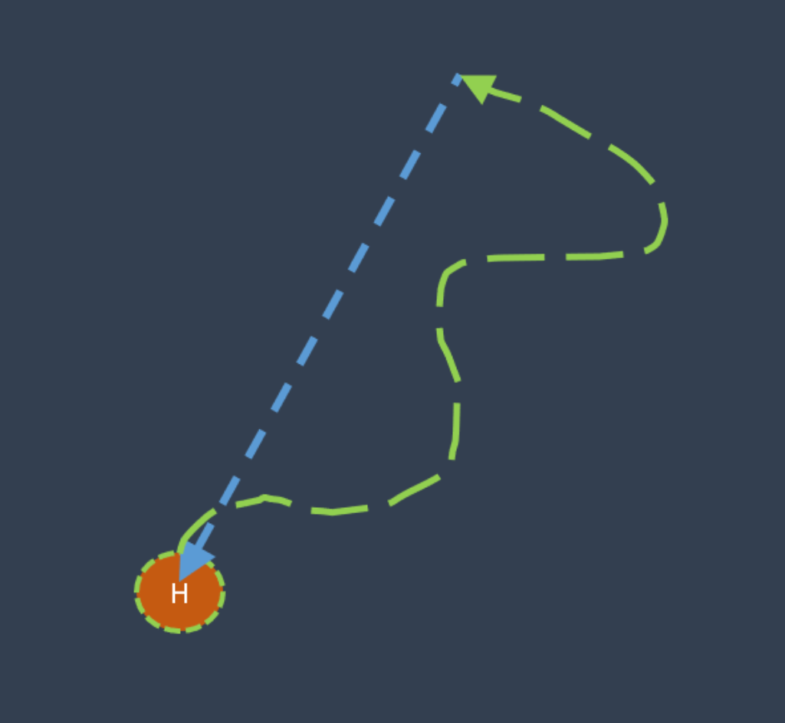
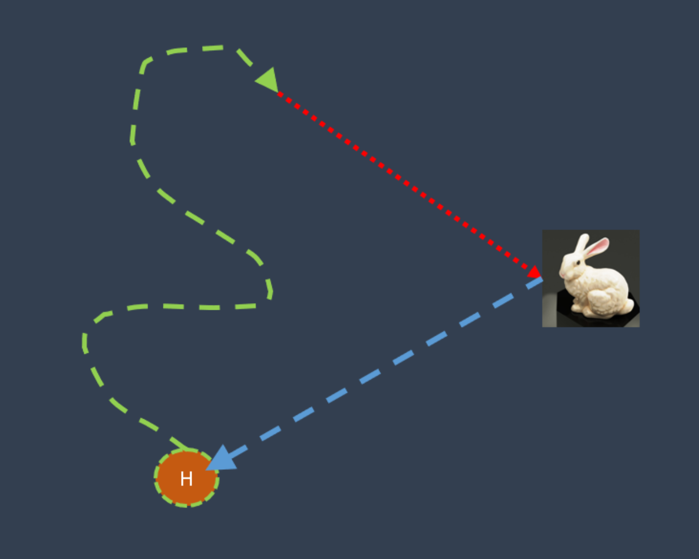

# Mobile-Robot-Challenge
We programmed a mobile robot (Picar-4wd + RPi Camera v3 wide) such that it was capable to return to its home position after a manual drive, and secondly return home, after a manual drive and detecting and touching a small object of choice. This was tested during two challenges:
1. A random drive was performed after which the robot autonomously returned to the home position.
2. A random drive was performed after which the robot autonomously found and touched.

Challenge 1: Return home after a random manual drive.

Challenge 2: Object finding and touching and return to home.
